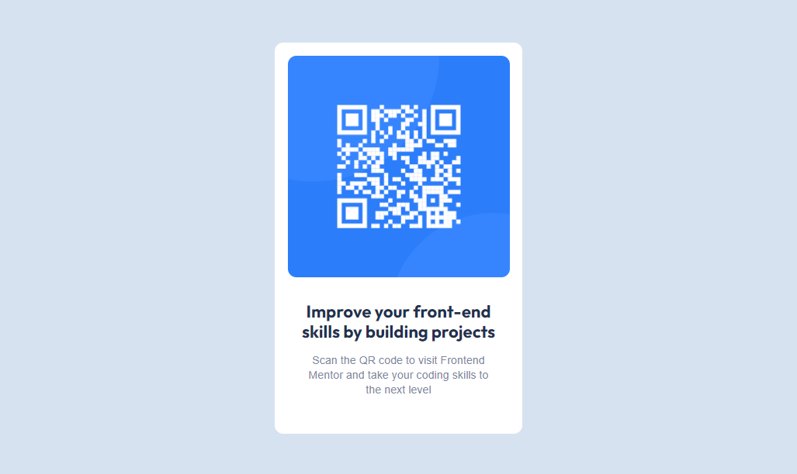

# Frontend Mentor - Qr code component

## Welcome! 👋

Thanks for watching

## The challenge

This challenge is to build out this Qr code component and get it looking as close to the design as possible.

Users should be able to:

- View the optimal layout depending on their device's screen size.
- See hover and focus states for interactive elements.

### Screenshot

## Deployment project link

- [Netlify](https://bespoke-meringue-663654.netlify.app/)

### Built with

- Semantic HTML5 markup
- CSS custom properties
- Flexbox

- Github - [JesusEmmanuelPonce](https://github.com/JesusEmmanuelPonce)
- Frontend Mentor - [@JesusEmmanuelPonce](https://www.frontendmentor.io/profile/JesusEmmanuelPonce)